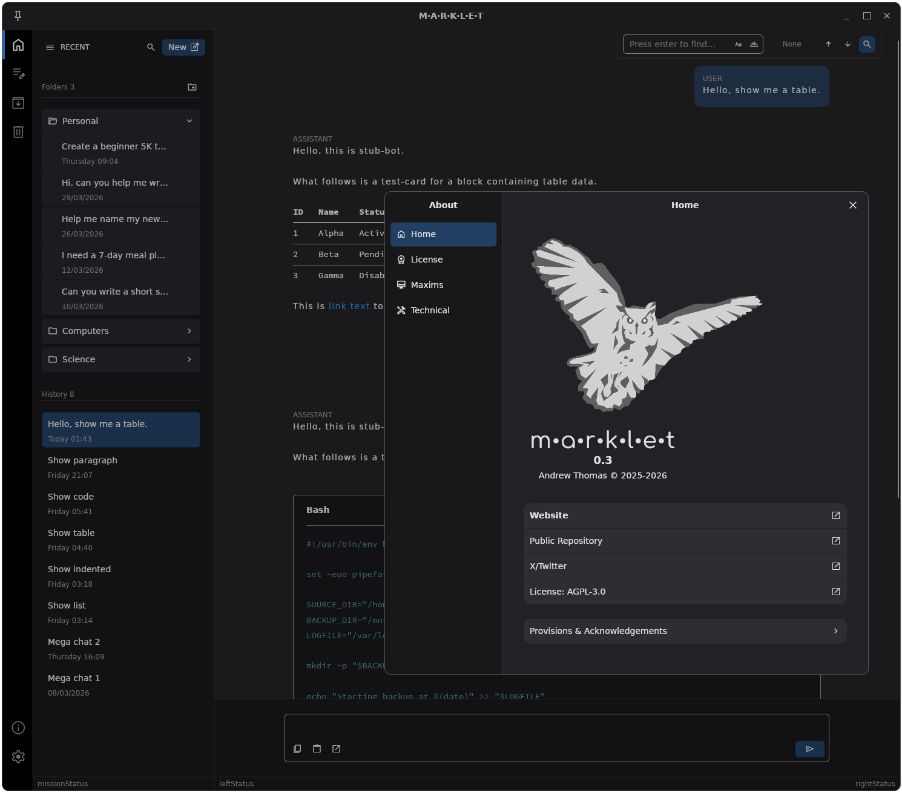
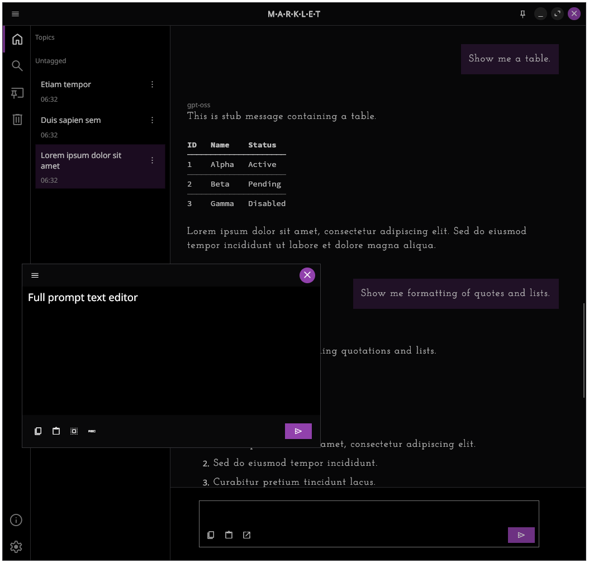

# MARKLET AI

**Marklet** is an open source AI client primarily intended for use with local AI models (i.e. in conjunction with Ollama or similar
runners). Its primary purpose is to do this simply and to do it well.

Follow [@KuiperZone](https://x.com/kuiperzone)

## PRE-RELEASE PREVIEW ONLY

IMPORTANT. This is an early preview release encompassing only the primary aspects of the user interface. It does NOT currently
contain the code needed to connect it to a model. There is no actual "AI" in this release. It is yet to be written.

That being said, you should hopefully find the user interface quite polished. You can download and run it, and it will
generate stub response messages intended only to exercise the user interface.

Above, initial version 0.1 in dark mode.

## Linux & Windows

[Downloads](https://github.com/kuiperzone/Marklet/releases/latest) 

Runable Linux AppImage and simple Windows zip are provided only for this release.

The purpose of this release is to get feedback. Please do follow this project to be notified as it develops.

## Background
Marklet is, for the time being, a personal project. It may not remain so in the future.

The author's perception of modern AI is somewhat nuanced. If you have negative feelings towards AI, then the author is likely
to share at least some of them. He does not believe, for example, that AI is conscious or that we have reached some kind of
super-singularity. Nevertheless AI is powerful and transformative. After all the disruption has played out, we are still going to
be left with AI in some form. If you can accept this, then this project might be for you. If you are more enthusiastic about AI,
then this may also be for you but you are free to regard it as "quirky".

Three quotations summarize the motivations for this project, as follows:

> *Consciousness cannot be accounted for in physical terms. For consciousness is absolutely fundamental. It cannot be accounted for in terms of anything else.* 
> **Erwin Schrödinger, 1931**

> *I point out to you... a lesson learned from past over-machined societies which you appear not to have learned. The devices themselves condition the users to employ each other the way they employ machines.* 
> **Leto II, God Emperor of Dune, Frank Herbert**

> *Any state, any entity, any ideology that fails to recognise the worth, the dignity, the rights of man... that state is obsolete.* 
> **The Obsolete Man, The Twilight Zone, E65**

Marklet is not intended to be all things to all people. The design of the software prioritizes personal use employing local
models with local data. It is not designed for use in enterprise environments or for mobile devices.

## Maxims of Marklet

The following principles are to guide the development of this software:

1. **Machines Should Not Deceive**

    Chat and AI systems should not masquerade as human, nor use manipulative psychology such as responses designed to appeal to
    ego. Modern speech synthesis should contain some audible trait making it discernible from that of human. The same applies to
    simulated visual appearances and all modes of perception.

2. **Automation of the Law of Unintended Consequences is a Bad Idea**

    Despite the allure, agentic automation and machine sub-goals are to be eschewed. Information is dissipated as deterministic
    processes interact with the environment. Without consciousness to intervene, consequences move away from desirable outcomes.
    This is not to say AI cannot interact with the environment, but only that decision making should not be chained as automated
    sub-goals. Moreover, it is not sufficient for humans to passively "check the data", but rather that they must be invested
    in its outcome.

3. **An Informational Monad is Heat Death**

    AI and automated processing should be local and under the control of those who are to receive its benefit or suffer
    its consequences (i,e. invested in it). AI should be embedded within the personal device, the robot, or employed as on-prem
    hardware, but not behind monolithic oneway mirrors. There must be valid separation at the level of conscious control so as
    to maintain an entropy differential. Without this, the flow of information ceases (i.e. informational heat death).

4. **Without Consciousness Automony Entropy Cannot be Regulated**

    The use of AI and automated systems to manipulate, restrict, subvert or otherwise control autonomous beings is destructive in
    the long-term. Without conscious autonomy, nothing new can be created and entropy cannot locally be reversed. The effect is one
    of slow degeneration.

5. **Responsibility Without Control is Merely to Suffer Consequences**

    Where autonomy is taken from you, you cannot be responsible for decisions made for you by others. Likewise, if you take
    autonomy from others, you therefore become responsible. If you seek to direct others, it is valid only where conscious
    consent exists that can be freely withdrawn.

The first one of these can easily be understood.

The next three stem from *information theory*.

For example, if you wish to understand why AI models collapse when fed with their own content, it is because information is a
fundamental quantity -- like energy which cannot be created by deterministic processes. As AI models are trained on increasing
amounts of previously generated AI content from the internet, such systems behave more like closed loops. In other words, they
become the equivalent of perpetual motion. This may fool for a while, but always stop working when the reservoir is exchausted.

You don't need information theory to understand this. The reason why digital computers cannot create information from nothing
is precisely because they are deterministic systems in which everything is **pre-determined* on the outside. This is simply what
determinism means. In other words, digital devices are merely transformers of that which had to exist prior. Information cannot
be created, but it can be lost, however. Hence, things degenerate.

Consciousness is that which reverses entropy. It is the only thing which can. You will go around in circles trying to define it
further or break it apart because it is fundamental.

It is essential, therefore, that local AI, under conscious control, plays a significant role in the future.

The last one? Well, that's deeper.

These maxims are not intended as "laws" to be imposed, but rather lessons which we must learn. Much of it is merely common
sense of the past, but codified for modern times. This thinking guides the Marklet software.

## Technical Introduction

Marklet is a cross-platform desktop application written in C# using the Avalonia graphical framework. It is not a web-app.

It initially supports:

* Linux
* Windows

The intention is to deliver a user interface which feels at home on any Linux desktop or other system. It will be familiar out
of the box, but offers configuration without being overly complicated.

It should also run out of the box when built on MacOS. At the time of writing, however, the author is lacking the facilities to
test this or to build deployment packages. There may be a glitch on MacOS, but no major hurdles. The build is simple and
lacks complex dependencies. Feedback in the [discussion section](https://github.com/kuiperzone/Marklet/discussions) would be
appreciated. Macs may indeed have an interesting future as Apple appear to be targeting local AI rather than data centers.

The software employs a Sqlite database for local data. In early pre-release versions, nothing is written to disk
except a few configuration settings in OS specific but standard locations (i.e. under `~.config/`).

## Roadmap

An approximate roadmap is as follows:

1. Implement full UI search capability
2. Changes and fixes to the user interface and data backend
3. Implement connection to model runners (this encompasses many things obviously)
4. Syntax high-lighting for fenced code
5. LaTeX math symbols in markdown
6. Support for attachments, images and RAG
7. Text to speech
8. Yet undecided features

The software is highly unlikely to support image or video generation by design. The software does not specially encrypt local
data. Rather, security is provided by being in control of your own local device. If your device is compromised, no one else
can be expected to mitigate this.

There are likely to be several interim releases before an initial version 1.0. Work continues, but please don't expect to see daily
updates or nightly builds in this repo. Fossil is its primary SCM. The code base is currently in-flux and may be subject to significant
refactoring in the early phases. It should be noted that the author is also prone to re-inventing wheels for which he is not even
sorry about. But this takes a time. To stand at least a chance of creating something even a little novel, copying and pasting is
not the starting point.

However, Marklet is just a client for runners and models created by others at the end of the day. It is appropriate, therefore, to
take a moment to express gratitude to all those who have worked to make local AI possible, as well as those who have progressed
AI over the decades for positive reasons. AI stands on the shoulders of many. Marklet is merely a front-end.

Finally, Marklet is created using native human thought. It has not been "vibe-coded".

### More Information

Please visit the official website for more information which will be populated as the project develops:

https://kuiper.zone/marklet

## Legal Stuff

COPYRIGHT : Andrew Thomas © 2025-2026 All rights reserved

Marklet is free software: you can redistribute it and/or modify it under
the terms of the GNU Affero General Public License as published by the Free Software
Foundation, version 3 of the License only.

Marklet is distributed in the hope that it will be useful, but WITHOUT
ANY WARRANTY; without even the implied warranty of MERCHANTABILITY or FITNESS
FOR A PARTICULAR PURPOSE. See the GNU Affero General Public License for more details.

In order to prevent "passing off", "Marklet" in connection with AI software is a
trademark of Andrew Thomas (kuiperzone). Marklet is, however, a non-commercial project.
Use of the name "Marklet" for derivative works or forks requires explicit written permission.
The same applies to the "Marklet Owl" image and other original graphical works. While
no great artistic skill is claimed, the image is nevertheless an original copyrighted
work of the author and is specifically excluded from the AGPL.