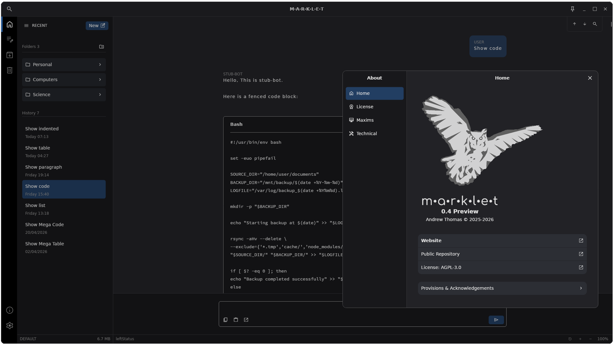
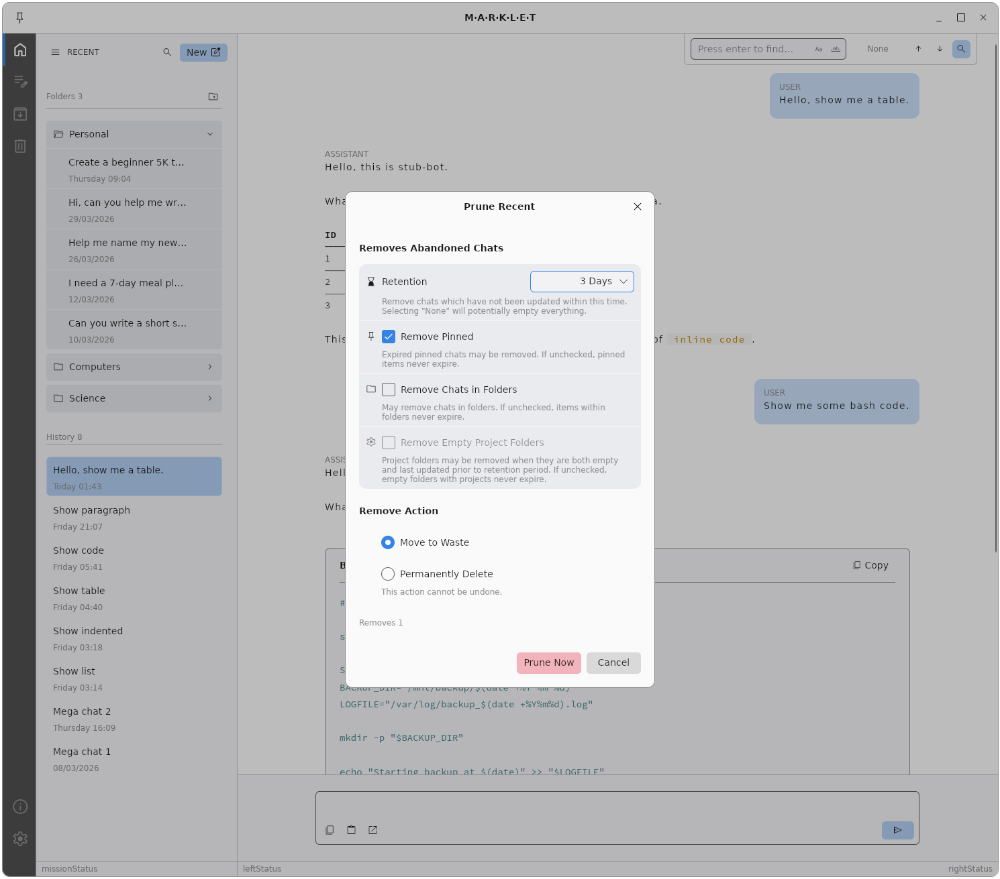

# MARKLET ALT-AI CLIENT

**Marklet** is an open source alt-AI client primarily intended for use with local models (i.e. in conjunction with Ollama or a
similar runner). Its primary purpose is to do this simply and to do it well. Marklet is a native desktop application and provides
a near out-of-box experience, comprising everything except the runner and models. It prioritises the individual, and the use of AI
for analysis rather than content generation. It is personal in the way a PC was once personal.

Above, early version 0.4 in dark mode.

### PREVIEW RELEASE

This is an early preview release encompassing the primary aspects of the user interface and database. It does not currently
contain the code needed to connect it to a model. There is no actual "AI" in this release. It is coming. Click `Watch` for updates.

That being said, you should find the user interface very polished. You can download and run it, and it will generate stub response
messages intended to exercise the user interface.

It initially supports:

* Linux
* Windows

[Downloads](https://github.com/kuiperzone/Marklet/releases/latest) 

Runable Linux AppImage and simple Windows zip are provided only for this release. It should build and run on MacOS, but the
means to test this is currently unavailable to the authors.

## Background
Marklet is not intended to be all things to all people. The design of the software prioritises personal use employing
local models with local data. It may not be suited for use in enterprise environments or on mobile devices.

Marklet is an experiment in *sovereign AI* predicated on the idea that, while large AI services bring destruction,
local AI will persist. Moreover, local AI will grant agency to those who can maintain their own autonomy in the
face of convenience and automation. As such, Marklet is not itself *vibe-coded*, but created with native thought.

### Roadmap

An approximate roadmap is as follows:

1. Continued development of the user interface and data backend
2. Completion of "note taking" interface
3. Completion of "project" interface
4. Implement connection to model runners and context generation
5. Syntax high-lighting for fenced code
6. LaTeX math symbols in markdown
7. Support for attachments, images
8. Text to speech, yet undecided features
9. A plugin architecture

There are likely to be several interim releases before an initial version 1.0. Work continues.

## Project Maxims

The following principles, grounded in an understanding of entropy, guide the development of this software:

1. **Machines Should Not Deceive**

    Chat and AI systems should not masquerade as human, nor use manipulative psychology such as responses designed to appeal to
    ego. Modern speech synthesis should contain some audible trait making it discernible from that of human. The same applies to
    simulated visual appearances and all modes of perception.

2. **Automation of the Law of Unintended Consequences is a Bad Idea**

    Despite the allure, agentic automation and machine sub-goals are to be eschewed. Information is dissipated as
    deterministic processes interact with the environment. Without consciousness to intervene, consequences move away
    from desirable outcomes. This is not to say AI cannot interact with the environment, but only that decision making
    should not be chained as automated sub-goals. Moreover, it is not sufficient for humans to passively "check the
    data", but must be personally invested in the outcome.

3. **An Informational Monad is Heat Death**

    AI and automated processing should be local and under the control of those who are to receive its benefit or suffer
    its consequences (i,e. local to those invested in it). Therefore, AI should be embedded within the personal device, the robot,
    or employed as on-prem hardware, but not behind monolithic one-way mirrors. There must be valid separation at the level of
    conscious control so as to maintain an entropy differential. Without this, the flow of information ceases (i.e. informational
    heat death).

4. **Without Consciousness Autonomy Entropy Cannot be Regulated**

    The use of AI and automated systems to manipulate, restrict, subvert or otherwise control autonomous beings is destructive in
    the long-term. Without conscious autonomy, nothing new can be created and entropy cannot locally be reversed. The effect is one
    of slow degeneration.

5. **Responsibility Without Control is Merely to Suffer Consequences**

    Where autonomy is taken from you, you cannot be responsible for decisions made for you by others. Likewise, if you take
    autonomy from others, you therefore become responsible. If you seek to direct others, it is valid only where conscious
    consent exists that can be freely and truly withdrawn.

This are not mere scientific philosophy, but directly applicable to engineering in that engineering should not be
applied to people. Maxims first published in 2025, and expanded [March 2026](https://kuiperzone.substack.com/p/why-im-building-ai-that-doesnt-pretend).

Follow author: [Substack](https://kuiperzone.substack.com/), [LinkedIn](https://www.linkedin.com/in/andythomas668/), [X @KuiperZone](https://x.com/kuiperzone)

### More Information

Please visit the official website for more information which will be populated as the project develops:

https://kuiper.zone/marklet-ai

## Legal Stuff

COPYRIGHT : Andrew Thomas © 2025-2026 All rights reserved

Marklet is free software: you can redistribute it and/or modify it under
the terms of the GNU Affero General Public License as published by the Free Software
Foundation, version 3 of the License only.

Marklet is distributed in the hope that it will be useful, but WITHOUT
ANY WARRANTY; without even the implied warranty of MERCHANTABILITY or FITNESS
FOR A PARTICULAR PURPOSE. See the GNU Affero General Public License for more details.

In order to prevent "passing off", "Marklet" in connection with AI software is a
trademark of Andrew Thomas (kuiperzone). Marklet is, however, a non-commercial project.
Use of the name "Marklet" for derivative works or forks requires explicit written permission.
The same applies to the "Marklet Owl" image and other original graphical works. While
no great artistic skill is claimed, the image is nevertheless an original copyrighted
work of the author and is specifically excluded from the AGPL.